<!--   pdf_document: default
 md_document -->

## 1) Data visualization: flights at ABIA

### Question :

**Q.1.a. What is the best time of day to fly to minimize delays, and
does this change by airline?**

### Graph1:

    ## Warning: Removed 1 row(s) containing missing values (geom_path).

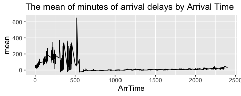

### Graph2:

    ## Warning: Removed 1 row(s) containing missing values (geom_path).

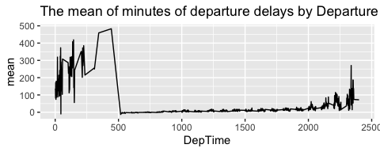

### Comment on Graphs 1 & 2 :

From both the graphs, we can observe that the lowest average of both the
arrival and departure delays by arrival and departure time respectively
are between 6am to 11pm and the highest average of both the arrival and
departure delays are after 11pm and before 6am, with a peak around 5am.

### Discussion on Graphs 1 & 2 :

We could have looked at different scenarios for this justification, like
there could have been delays prior to coming at Austin due to various
possible reasons. But as both the arrival and departure delays occur
almost at the same time, therefore we may conclude that the passenger
traffic is at maximum around 5am. This may be due to the fact that more
people try to arrive in Austin very early in the morning to start their
day afresh and also they try to depart early after finishing their day’s
work. This may be also due to the fact that the weather in Austin is
more clear during the day till midnight.

### Graph3:

    ## Warning: Removed 1 row(s) containing missing values (geom_path).

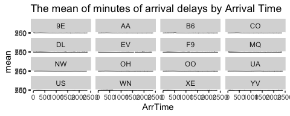

### Graph 4:

    ## Warning: Removed 1 row(s) containing missing values (geom_path).

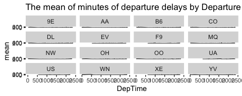

### Comments on Graphs 3 & 4:

From both the graphs, we can observe that the lowest average of both the
arrival and departure delays by arrival and departure time respectively
are between 7am to 11pm and the highest average of both the arrival and
departure delays are after 11pm and before 7am.

### Discussion on Graphs 3 & 4 :

Again, from both these graphs, what we can observe is that both the
arrival and departure delays are minimum in between 7am till 11pm with
occasional spikes of arrival and departure delays during the day.
Maximum arrival and departure delays have occurred for Endeavor Air
(code-9E) and Jet Blue (code-B6) respectively. We may like to correlate
such delay with excess passenger traffic from midnight till early
morning as Austin is becoming a tech/ industrial city. There is people’s
urge to start their day by arriving early here and also depart after
finishing a day’s work. The weather condition during daytime and
nighttime can also be a factor for such arrival and departure delays. It
may be a fact that the weather in Austin is more clear during the day
till midnight.

**Q.1.b.What is the best time of year to fly to minimize delays, and
does this change by destination? (You’d probably want to focus on a
handful of popular destinations.)**

### Graph5:

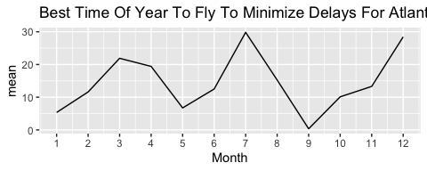

### Graph6:

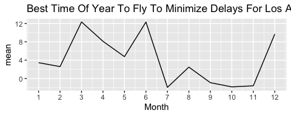

### Graph7:

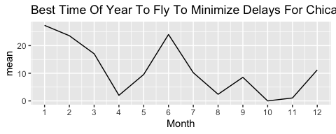

### Graph8:

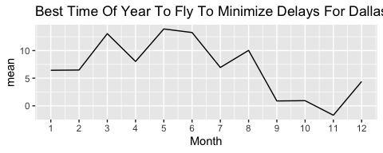

### Graph9:

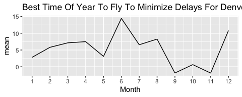

### Graph10:

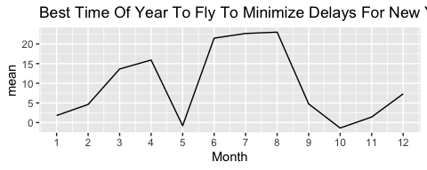

### Comments on Graphs 5 to 10:

Now from these graphs, we can easily observe that the minimum delays
have occurred during the months of September to November, with a low
trend of delay occuring during May of each year.

### Discussion on Graphs 5 to 10:

As per question requirement, I have selected top six airports by
passenger traffic (source -
<https://www.world-airport-codes.com/us-top-40-airports.html>). Here we
have noticed that the minimum delays have occurred during the months of
September to November, with a low trend of delay occuring during May of
each year. It can be due to the fact that the airlines try to provide
the best service during the holiday period to attract the maximum
passengers and increase their service ratings. It can also occur due to
the weather conditions which is at its best during the summer (May) and
Autumn (September to November).

\##Q.1.c)

### Question:

**What is the best month to fly to minimize arriving delays, and does
this change by airline?**

### Graph 11:

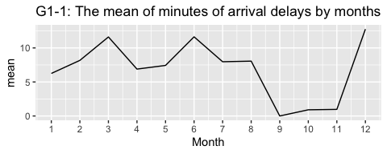

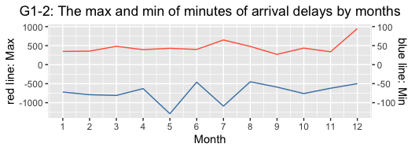

### Comment on Graph 11:

We can see from G1-1 of Graph 1 that the highest average of the arrival
delays by month is December, and that on September, October and November
are low compared to other months. Also, The G1-2 graph shows that the
month of the highest arrival delay is December, and that of the lowest
is May.

### Discussion on Graph 11:

So, from these results, we can estimate the following points. First, the
number of arrival delays probably is caused by the number of passengers
at ABIA. For example, a low number of arrival delays means fewer
passengers. Therefore, from September to November, the number of
passengers at ABIA might be lower than that of the other months. This is
because students in Austin start their semesters and do not use the
airport to go out of the city. In contrast, in December, the number of
passengers will increase drastically; for example, they fly to their
home countries and other cities in holidays.

Focusing on the max and min of the number, we can easily understand why
December has the highest number of arrival delays. However, we also need
to consider why we can see the lowest number in May. So, I provide one
of the reasons here: although airline companies offer a lot of airplanes
to prepare students to go out of cities after graduation or the end of
the semester, that did not happen by any reason.

### Graph 12:

<table>
<thead>
<tr class="header">
<th style="text-align: right;">Month</th>
<th style="text-align: left;">UniqueCarrier</th>
<th style="text-align: right;">mean</th>
</tr>
</thead>
<tbody>
<tr class="odd">
<td style="text-align: right;">12</td>
<td style="text-align: left;">XE</td>
<td style="text-align: right;">-1</td>
</tr>
<tr class="even">
<td style="text-align: right;">12</td>
<td style="text-align: left;">UA</td>
<td style="text-align: right;">4</td>
</tr>
<tr class="odd">
<td style="text-align: right;">12</td>
<td style="text-align: left;">AA</td>
<td style="text-align: right;">6</td>
</tr>
<tr class="even">
<td style="text-align: right;">12</td>
<td style="text-align: left;">US</td>
<td style="text-align: right;">6</td>
</tr>
<tr class="odd">
<td style="text-align: right;">12</td>
<td style="text-align: left;">YV</td>
<td style="text-align: right;">12</td>
</tr>
<tr class="even">
<td style="text-align: right;">12</td>
<td style="text-align: left;">WN</td>
<td style="text-align: right;">13</td>
</tr>
</tbody>
</table>

<table>
<thead>
<tr class="header">
<th style="text-align: right;">Month</th>
<th style="text-align: left;">UniqueCarrier</th>
<th style="text-align: right;">mean</th>
</tr>
</thead>
<tbody>
<tr class="odd">
<td style="text-align: right;">12</td>
<td style="text-align: left;">OH</td>
<td style="text-align: right;">41</td>
</tr>
<tr class="even">
<td style="text-align: right;">12</td>
<td style="text-align: left;">EV</td>
<td style="text-align: right;">26</td>
</tr>
<tr class="odd">
<td style="text-align: right;">12</td>
<td style="text-align: left;">OO</td>
<td style="text-align: right;">22</td>
</tr>
<tr class="even">
<td style="text-align: right;">12</td>
<td style="text-align: left;">B6</td>
<td style="text-align: right;">19</td>
</tr>
<tr class="odd">
<td style="text-align: right;">12</td>
<td style="text-align: left;">CO</td>
<td style="text-align: right;">17</td>
</tr>
<tr class="even">
<td style="text-align: right;">12</td>
<td style="text-align: left;">DL</td>
<td style="text-align: right;">16</td>
</tr>
</tbody>
</table>

This data includes 15 airline companies, which are Endeavor Air(9E),
American Airlines(AA), JetBlue(B6), Continental Airlines(CO), Delta Air
Lines(DL), ExpressJet(EV), Frontier Airlines(F9), American Eagle
Airlines(MQ), Northwest Airlines(NW), PSA Airlines(OH), SkyWest
Airlines(OO), United Airlines(UA), US Airways(US), Southwest
Airlines(WN), JSX(XE), Mesa Airlines(YV).

It is difficult for us to see the number of arriving delays all month to
judge which airline is the best. So ,here, I focus on that of December
because the number of arriving delays is highest on December.

### Comment on Graph 12 and Tables:

The Graph 2 shows that the number of arriving delays by months and
airlines. The first table says its data by ascending order and the
second table do it by decending order.

The fluctiation of most of airlines looks like that of the average one
except for some companies, such as EV and DL. The companies with low
delays on Decemberare JSX, United Airline and American Airline, and the
companies with high delays on Decemberare PSA Airline, Express Jet and
SkyWest Airlines.

### Discussion on Graph 12:

United Airlines and American Airlines are very famous and big companies
with many planes and flight paths. So if some of the airplanes they have
were delayed, they might have another way to avoid delays more than
small companies. So, therefore, big firms were better if you wanted to
avoid the uncertainty of arrival delays of your air in December.

### Conclusion:

If you want to avoid arrival delays of your air, especially in December
when many delays happen, you should choose big firms like United
Airlines and American Airlines.

## Q.2) Wrangling the Olympics

### A) What is the 95th percentile of heights for female competitors across all Athletics events?

    ## 95% 
    ## 183

From the result, the answer is **183**

### B) Which single women’s event had the greatest variability in competitor’s heights across the entire history of the Olympics, as measured by the standard deviation?

<table>
<thead>
<tr class="header">
<th style="text-align: left;">event</th>
<th style="text-align: right;">sd</th>
<th style="text-align: left;">sex</th>
</tr>
</thead>
<tbody>
<tr class="odd">
<td style="text-align: left;">Rowing Women’s Coxed Fours</td>
<td style="text-align: right;">10.865490</td>
<td style="text-align: left;">F</td>
</tr>
<tr class="even">
<td style="text-align: left;">Basketball Women’s Basketball</td>
<td style="text-align: right;">9.700255</td>
<td style="text-align: left;">F</td>
</tr>
<tr class="odd">
<td style="text-align: left;">Rowing Women’s Coxed Quadruple Sculls</td>
<td style="text-align: right;">9.246396</td>
<td style="text-align: left;">F</td>
</tr>
<tr class="even">
<td style="text-align: left;">Rowing Women’s Coxed Eights</td>
<td style="text-align: right;">8.741931</td>
<td style="text-align: left;">F</td>
</tr>
<tr class="odd">
<td style="text-align: left;">Swimming Women’s 100 metres Butterfly</td>
<td style="text-align: right;">8.134398</td>
<td style="text-align: left;">F</td>
</tr>
<tr class="even">
<td style="text-align: left;">Volleyball Women’s Volleyball</td>
<td style="text-align: right;">8.101521</td>
<td style="text-align: left;">F</td>
</tr>
</tbody>
</table>

Therefore, the answer is **Rowing Women’s Coxed Fours**.

### c) How has the average age of Olympic swimmers changed over time? Does the trend look different for male swimmers relative to female swimmers?

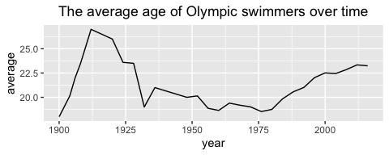

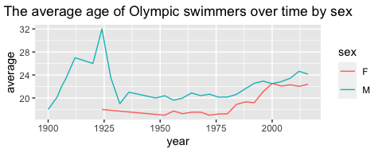

From the above graph, the average age of Olympic swimmers has increased
over time after 1925 for both males and females. The average age for
male swimmers has always been higher than the average age of female
swimmers since 1900. However, the difference in the average age between
males and females has become narrow recently compared to the past.

## 3) K-nearest neighbors: cars

### Steps

We did this following steps to get optimal K and prediction of price
with 2 ways, spilitting the data with 0.8 probabilities and K-fold cross
validation

Especially, the steps of the K-fold is in the following - 1. Made two
datasets for each trim of 350 and 65 AMG - 2. Split the data into a
training and a testing set with 5 Folds randomly. - 3. Get RMSE and
Prediction of price on mileage. - 4. Find the value of RMSE to
minimization of K in 1-200 - 5. Plot the prediction of the optimal K

### Results

#### Trim: 350

#### Split the data into a training and a testing set with the probability 0.8

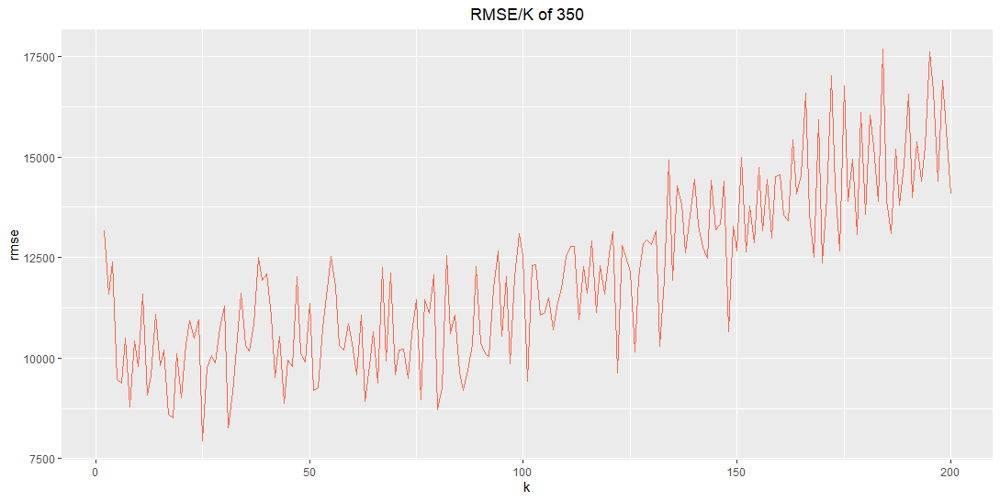

<table>
<thead>
<tr class="header">
<th style="text-align: left;">x</th>
</tr>
</thead>
<tbody>
<tr class="odd">
<td style="text-align: left;">min_k=25</td>
</tr>
<tr class="even">
<td style="text-align: left;">min_rmse=7950.602</td>
</tr>
</tbody>
</table>

From the above result, the optimal K is 25 because of the minimum RMSE
on it. The prediction is in the following.

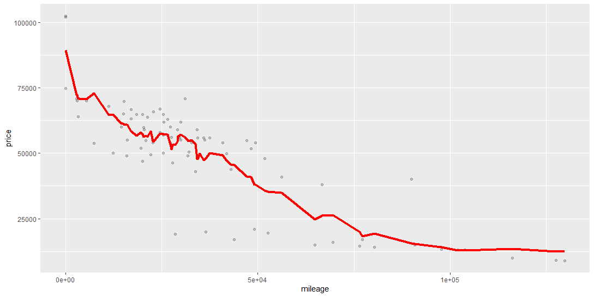

#### K-CV

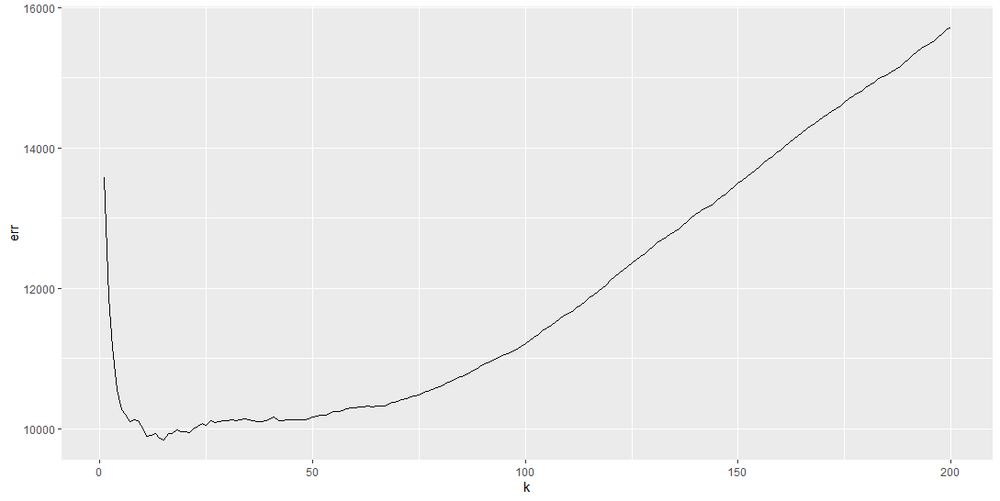

<table>
<thead>
<tr class="header">
<th style="text-align: left;">x</th>
</tr>
</thead>
<tbody>
<tr class="odd">
<td style="text-align: left;">min_k=15</td>
</tr>
<tr class="even">
<td style="text-align: left;">min_err=9845.729</td>
</tr>
</tbody>
</table>

From the above result, the optimal K is 15 because of the minimum RMSE
on it. The prediction is in the following.

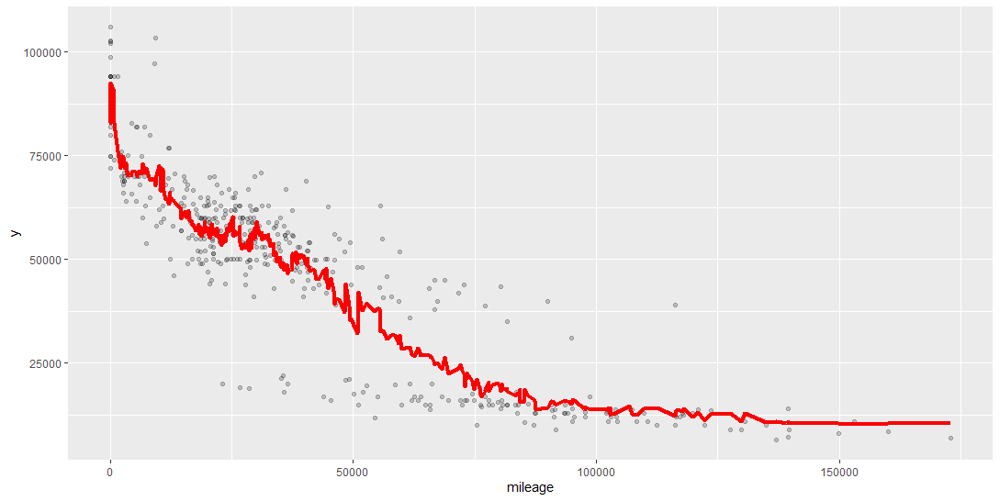

#### Trim: 65 AMG

#### Split the data into a training and a testing set with the probability 0.8

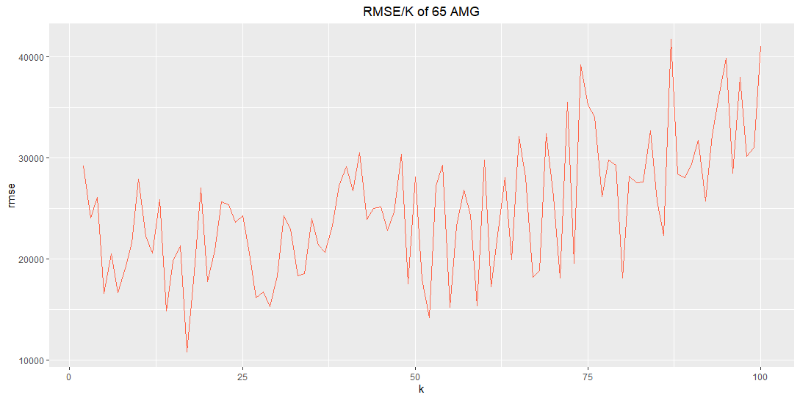

<table>
<thead>
<tr class="header">
<th style="text-align: left;">x</th>
</tr>
</thead>
<tbody>
<tr class="odd">
<td style="text-align: left;">min_k=17</td>
</tr>
<tr class="even">
<td style="text-align: left;">rmse=10805.82</td>
</tr>
</tbody>
</table>

From the above result, the optimal K is 17 because of the minimum RMSE
on it. The prediction is in the following.

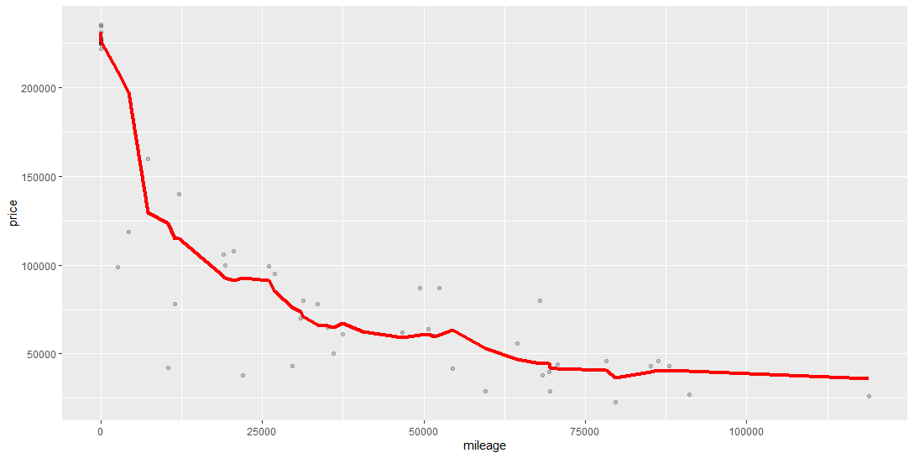

#### K-fold

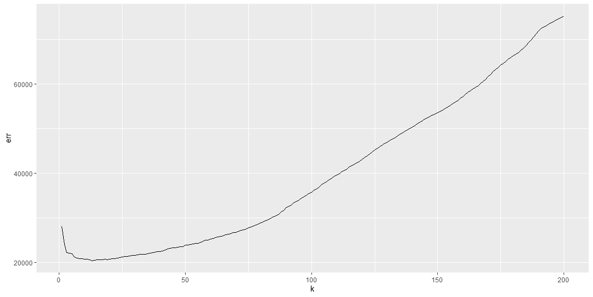

<table>
<thead>
<tr class="header">
<th style="text-align: left;">x</th>
</tr>
</thead>
<tbody>
<tr class="odd">
<td style="text-align: left;">min_k=13</td>
</tr>
<tr class="even">
<td style="text-align: left;">min_err=20462.65</td>
</tr>
</tbody>
</table>

From the above result, the optimal K is 13 because of the minimum RMSE
on it. The prediction is in the following.

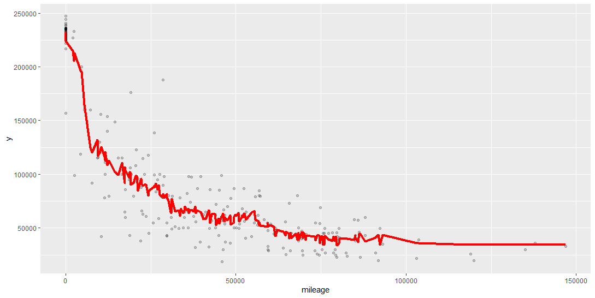

### Which trim yields a larger optimal value of K? Why do you think this is?

The optimal value of k of 350 is larger than that of 65 AMG. This is
because the number of observations for 350 is 416, which is larger than
that of observations for 65 AMG (which is 292). It implies that the
larger number of observation needs larger K to balance between its bias
and variance. If the sample size is large, for large k values, we have
more data points and narrow range of values leading to less bias.
Therefore, we choose large optimal k value when sample size is large. On
the other hand, when the sample size is low, we use low optimal k value
because of the lower bias compared to large k values. At small sample
size, the bias for large k value is high & the lower variance that comes
with large k-values cannot offset the higher bias. So in the case of
small sample size, compared to large k values, the low k value minimizes
the rmse.
